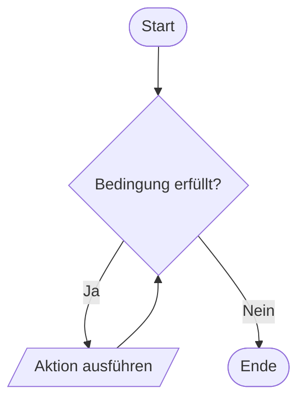

# Schleifen



## For-Schleife

```java
for (int i = 0; i < /* Num of times to execute */; i++) {
	// ...
}
```

Der Postinkrement-Operator sorgt dafür, dass während der Schleife noch der vorherige Wert von i verwendet wird und i erst nach dem Ausführen des Blocks erhöht wird. Mit dem Preinkrement-Operator (++i) würde i vor der Ausführung erhöht werden.

## While-Schleife

```java
while (/* Bedingung */) {
	// ...
}
```

## Do-While-Schleife

```java
do {
	// ...
} while (/* Bedingung */);
```